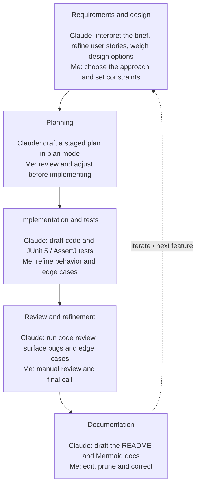

# AI usage

This project was developed with assistance from **Claude Code** (Anthropic's command-line coding
agent). AI was used to improve quality and velocity; all requirement interpretation, design
decisions, and final behavior were owned and reviewed by me. Per the task note, submissions are
evaluated equally with or without AI.

## Development cycle

The work moved through the stages below as a loop. At each stage, Claude Code drafted and proposed
while I reviewed and decided; review findings and new requirements feed back into the next cycle.

## How it was used

We worked as a pair across the whole lifecycle — Claude proposed and drafted, I reviewed,
challenged, and made the final calls.

- **Requirements & design** — Claude helped interpret the brief, refine the user stories, and weigh
  design options: exact-`long` minor-unit money, a per-currency balanced double-entry ledger,
  transaction-based concurrency (`SELECT … FOR UPDATE` in canonical account order), ports &
  adapters, and DB-enforced idempotency. I chose the approaches and set the constraints.
- **Planning** — I used Claude Code's plan mode to break the build into staged, reviewable steps and
  adjusted each plan before implementation.
- **Implementation & tests** — Claude drafted code and the JUnit 5 / AssertJ tests (including
  concurrency stress), which I reviewed and refined against the intended behavior and edge cases.
- **Review & refinement** — Iterative back-and-forth: I manually reviewed changes and ran Claude's
  code review to catch bugs, edge cases, and simplifications.
- **Documentation** — Claude drafted the README and the `doc/` Mermaid diagrams; I edited, pruned,
  and corrected them.

## What it contributed

Claude accelerated drafting (code, tests, docs), surfaced edge cases and design alternatives, and
acted as a second reviewer via code review. I retained authorship of the problem framing, every
design and behavior decision, and final approval of correctness.
