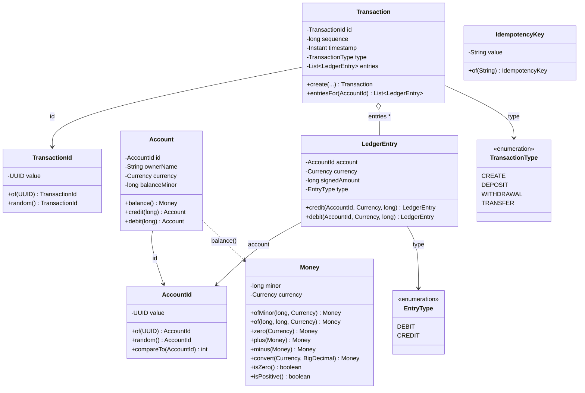

# Entity / data model

The domain is a small set of **immutable value objects** plus the double-entry ledger records.
All money is stored as `long` minor units; no floating point anywhere in the model.

## Class diagram

## Field reference

### `Money` — an amount in a currency (immutable)
| Field | Type | Notes |
|---|---|---|
| `minor` | `long` | Minor units, always **≥ 0** (negative rejected at construction). E.g. HKD 12.34 → `1234`. |
| `currency` | `java.util.Currency` | ISO 4217. Determines `getDefaultFractionDigits()` for FX rounding. |

Invariants: non-negative; `plus`/`minus` require matching currency; `convert` rounds `HALF_UP`
to the target's minor units.

### `Account` — a bank account (immutable value; balance changes via copies)
| Field | Type | Notes |
|---|---|---|
| `id` | `AccountId` | Stable identity (UUID). Used as the lock key. |
| `ownerName` | `String` | Trimmed; non-blank. |
| `currency` | `Currency` | Fixed at creation, **never** changes. |
| `balanceMinor` | `long` | Minor units, ≥ 0. Mutated only via `credit`/`debit`, which return **new** accounts. |

Invariants: currency immutable; balance never negative (the service checks sufficiency under
lock before debiting).

### `Transaction` — an atomic double-entry posting (immutable)
| Field | Type | Notes |
|---|---|---|
| `id` | `TransactionId` | UUID. |
| `sequence` | `long` | Monotonic, assigned by `DefaultBankingService`. |
| `timestamp` | `Instant` | From an injected `Clock` (deterministic in tests). |
| `type` | `TransactionType` | `CREATE` / `DEPOSIT` / `WITHDRAWAL` / `TRANSFER`. |
| `entries` | `List<LedgerEntry>` | Defensive copy; **must net to zero per currency** (validated in `create`). |

### `LedgerEntry` — one signed movement (immutable)
| Field | Type | Notes |
|---|---|---|
| `account` | `AccountId` | The account (or a contra account) the entry posts to. |
| `currency` | `Currency` | The currency of this entry. |
| `signedAmount` | `long` | Minor units **with sign**: positive for CREDIT, negative for DEBIT. |
| `type` | `EntryType` | `CREDIT` or `DEBIT` (mirrors the sign, kept for readability). |

Built only via `credit(...)` / `debit(...)`, which take a positive magnitude and derive the sign.

### `AccountId` / `TransactionId` / `IdempotencyKey`
UUID-backed (ids) or string-backed (key) value objects with value equality. `AccountId` is
`Comparable` so the service can acquire `SELECT … FOR UPDATE` row locks in a single canonical
order (deadlock-free).

## System (contra) accounts

Defined in `ContraAccountIds` — fixed UUIDs that appear only in ledger entries, never as
customer `Account`s with balances:

| Constant | Used for |
|---|---|
| `CASH_CONTRA` | Counterparty for deposits and withdrawals (money enters/leaves the system here). |
| `FX_CONTRA` | Counterparty for cross-currency transfers; absorbs the FX position and rounding residue. |

## Derived quantities

- **Account balance** = `Σ signedAmount` over all `LedgerEntry`s for that account (across every
  transaction). The cached `balanceMinor` is kept in sync with this sum; tests assert the two agree.
- **Ledger integrity** = for every `Transaction`, `Σ signedAmount` grouped by currency is `0`.
