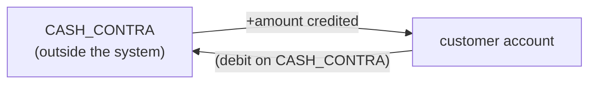
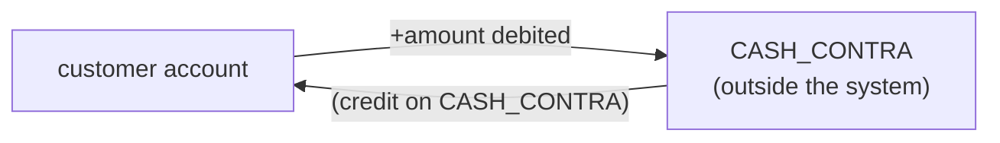
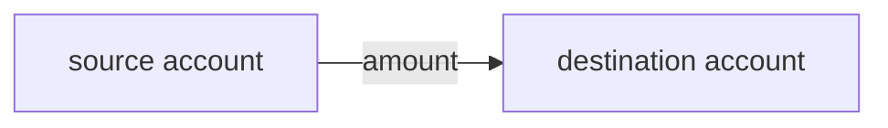
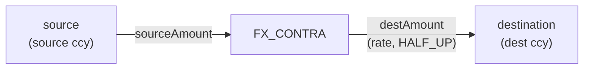
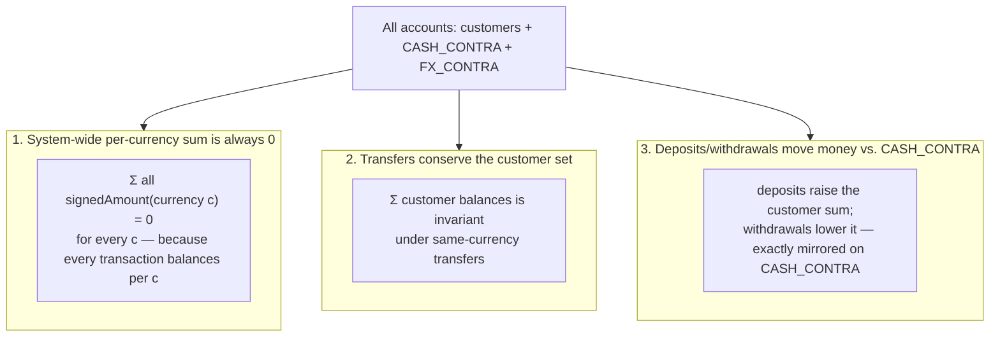
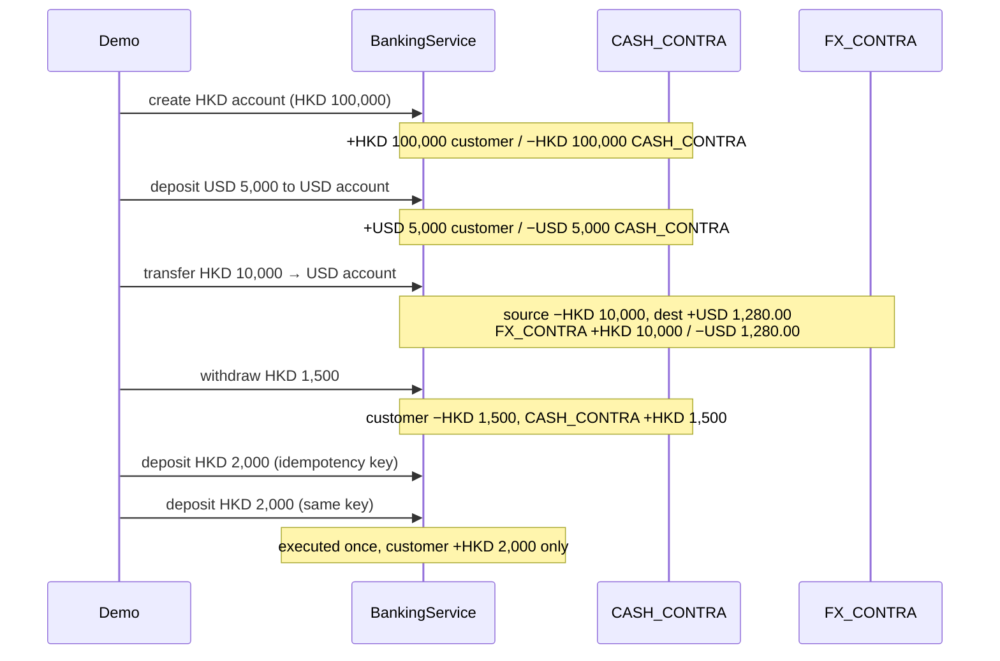

# Money movement

How money enters, leaves, and moves within the system, and the conservation rules that follow
from the double-entry ledger. Arrows show the direction positive money flows; the contra account
is always the balancing counterparty.

## Deposit — money enters

A deposit increases a customer balance and decreases `CASH_CONTRA` by the same amount. Net new
money in the customer set = `+amount`.

## Withdrawal — money leaves

A withdrawal decreases the customer balance and increases `CASH_CONTRA`. The customer set loses
`amount`. Overdraft is impossible: sufficiency is checked **under the account lock** before the
debit.

## Transfer — same currency (no money created/destroyed)

Same-currency transfer moves `amount` directly. The sum of the two (and of all) real-account
balances is unchanged — money is merely relocated.

## Transfer — cross currency (money routed via the FX desk)

The source currency debits the source and credits `FX_CONTRA`; the destination currency debits
`FX_CONTRA` and credits the destination. `FX_CONTRA` ends up long the source currency and short
the destination currency — i.e. it holds the FX position.

### FX rounding residue

Conversion uses `BigDecimal` with `RoundingMode.HALF_UP` to the destination's minor units. When
the converted amount is not exact, the rounding difference stays on `FX_CONTRA` as FX P&L — it is
never silently dropped or added to a customer.

Example: HKD 10.55 @ 0.128 → exact USD 1.3504 → rounded **USD 1.35**. The `0.0004 USD` is the
`FX_CONTRA` P&L. (Full entry table in [ledger.md](ledger.md).)

## Conservation laws

These are direct consequences of per-currency double-entry and are verified by the tests.

- **Closed-system conservation** (used by `ConcurrencyStressTest`): with a set of same-currency
  accounts performing only transfers among themselves, `Σ balances` is constant, even under heavy
  concurrency. Failed transfers (insufficient funds, self-transfer) move nothing, so conservation
  still holds.
- **No overdraft, no lost updates**: because each account's balance is read-then-written under
  that account's lock, concurrent operations never lose an update and never drive a balance below
  zero.

## Putting it together — a session

A small end-to-end scenario and how money moves (this mirrors `Demo.main()`):

Every customer balance change above is matched by an equal, opposite entry on a contra account,
so the system-wide per-currency sum remains zero throughout.
