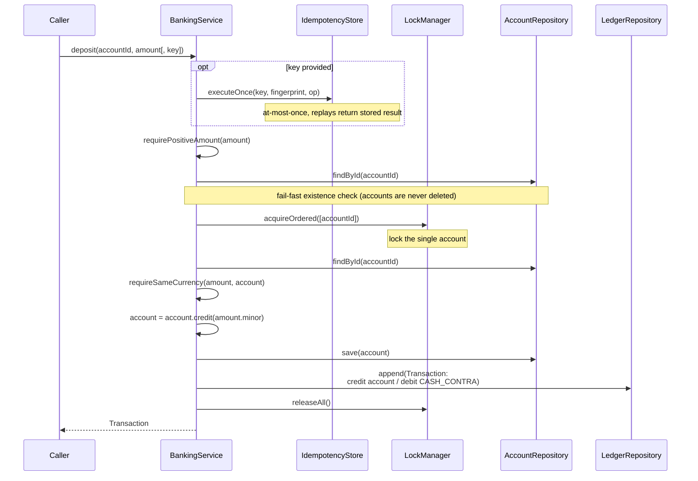
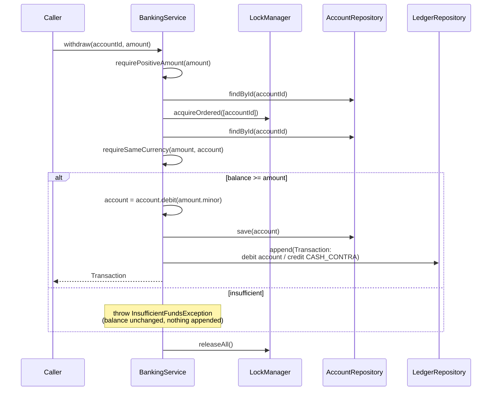
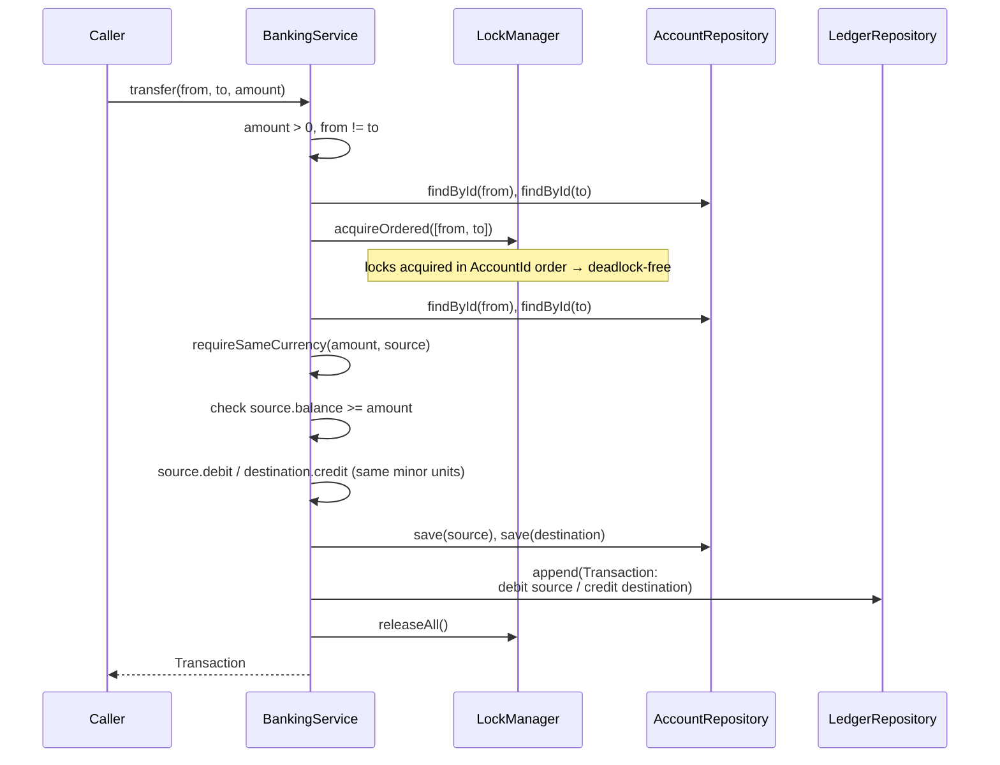
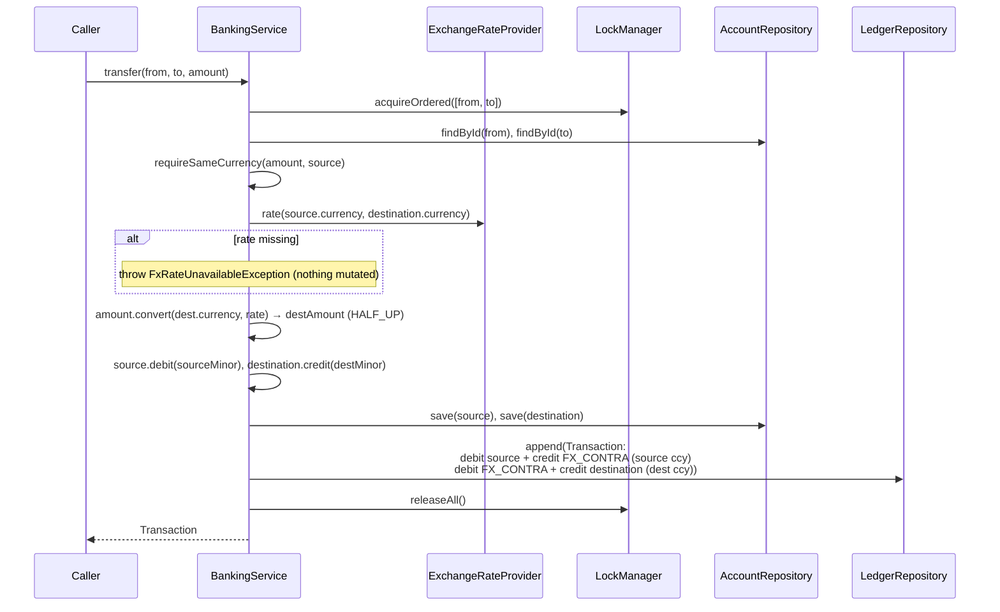
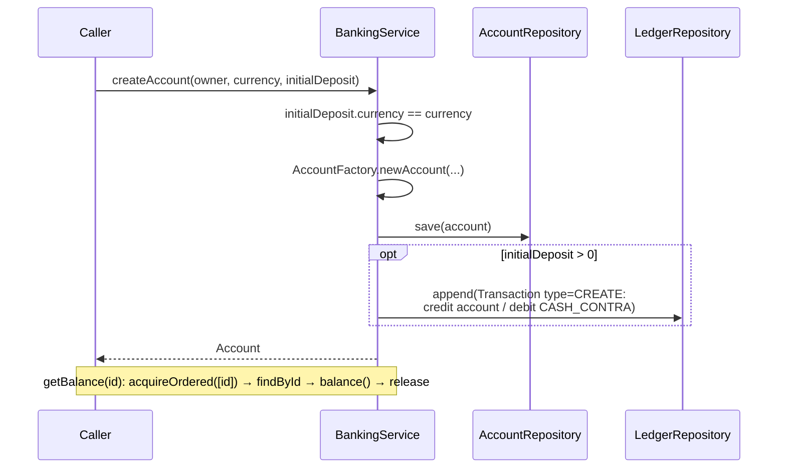
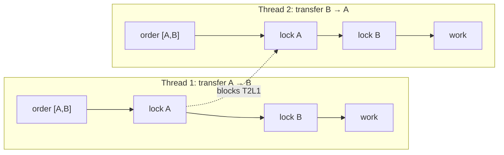
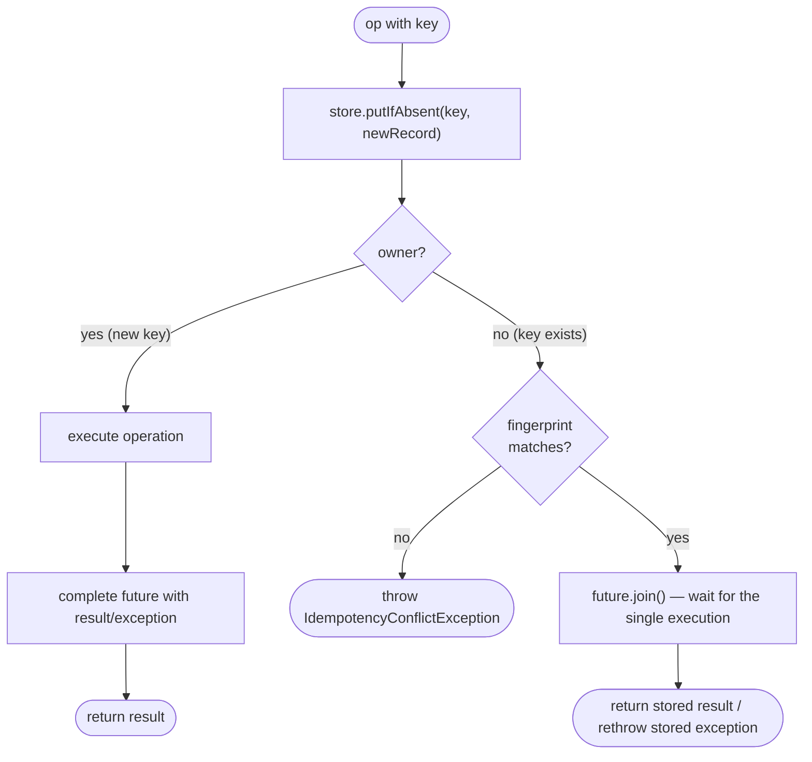

# Operation flows

Step-by-step flows for each `BankingService` operation, plus the two cross-cutting concerns —
concurrency (locking) and idempotency. Every mutating operation is **atomic**: all balance
changes and the ledger posting happen together, under the relevant account locks, or not at all.

## Deposit

## Withdrawal

Same shape as deposit, but the sufficiency check runs **under the lock** so a concurrent
withdrawal cannot overdraw:

## Transfer — same currency

## Transfer — cross currency (FX)

When source and destination currencies differ, the amount is converted at the spot rate and the
FX contra absorbs the position (and any rounding residue) so each currency leg balances
independently:

## Account creation & balance

A zero opening deposit creates the account but posts no ledger transaction.

## Concurrency: ordered locking

The `LockManager` always acquires account locks in `AccountId.compareTo` order. Two transfers
running in opposite directions between the same accounts therefore request the **same** lock
sequence — there is no cyclic wait, so the system cannot deadlock.

Self-transfers are de-duplicated before locking (the id set has one element), so a single lock is
taken. Locks are released in reverse acquisition order in a `finally` block. This same
"canonical lock order" maps directly onto `SELECT … FOR UPDATE` ordering in a future database
adapter.

## Idempotency: at-most-once execution

Mutating operations accept an optional `IdempotencyKey`. The store claims the key atomically
(`putIfAbsent`); the first caller executes and stores the result (success **or** the thrown
business exception); concurrent or replayed duplicates with the same key wait for and return that
single result. Reusing a key with **different** parameters is rejected.

Operations called without a key bypass the store entirely and always execute.
