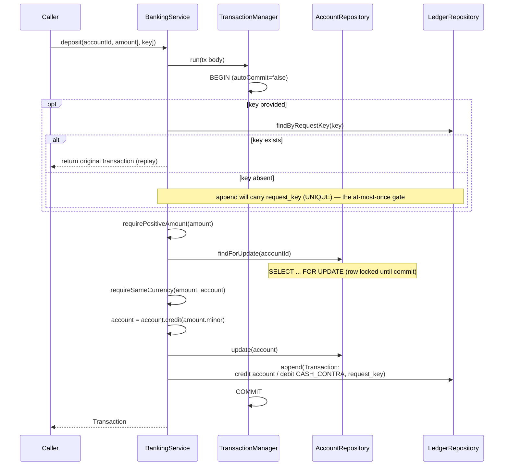
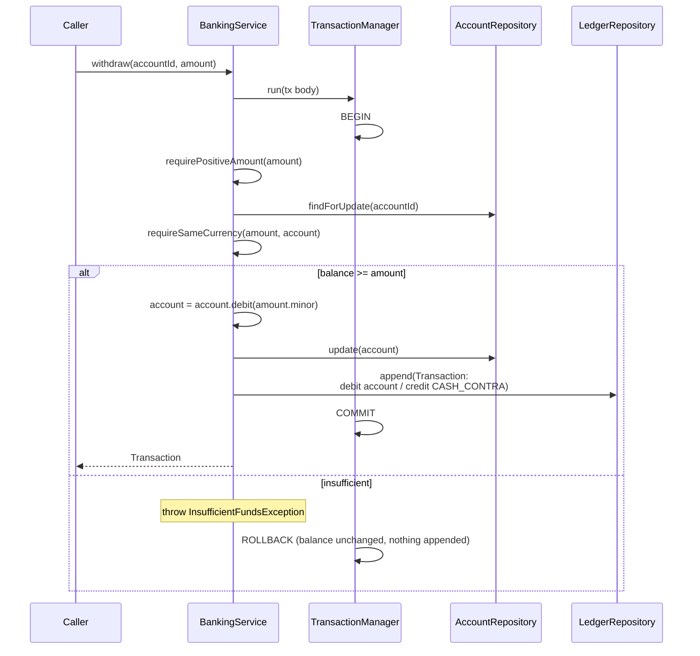
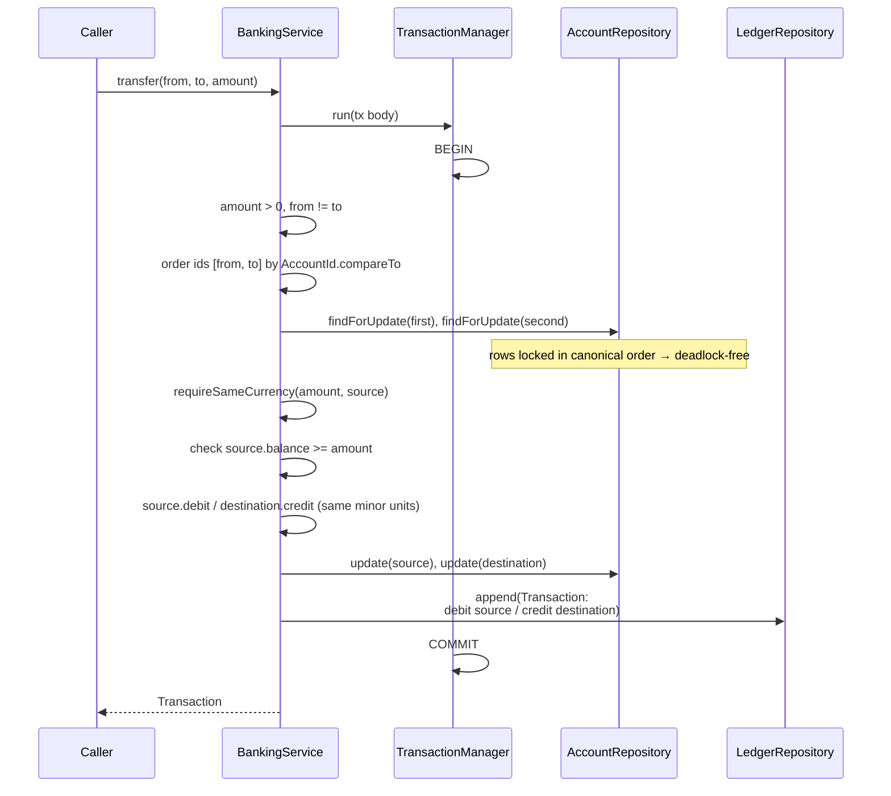
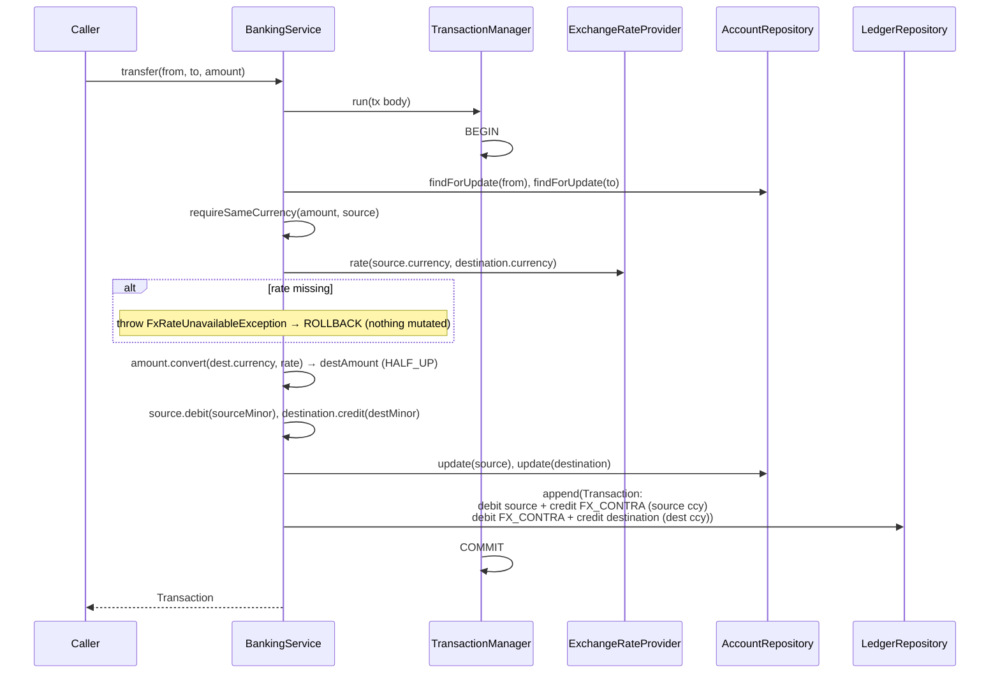
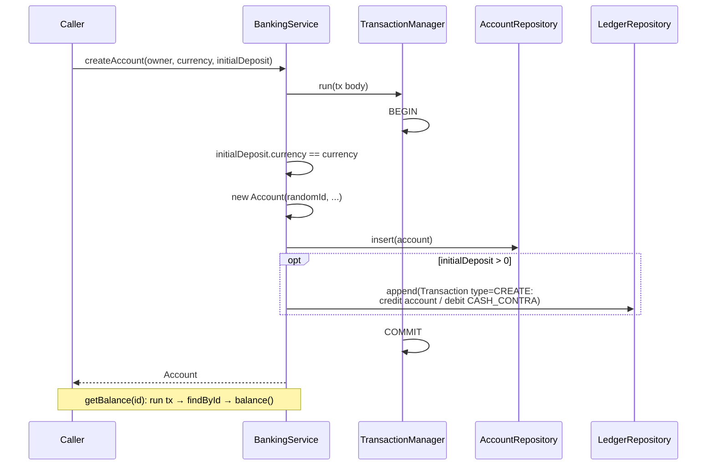
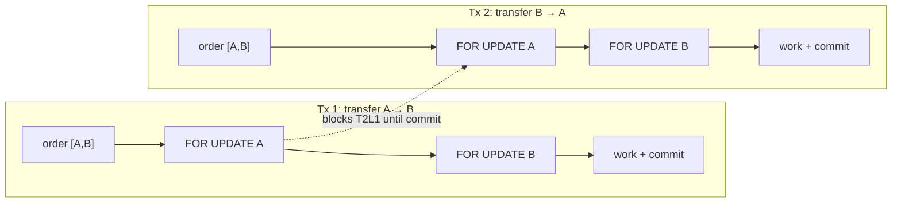
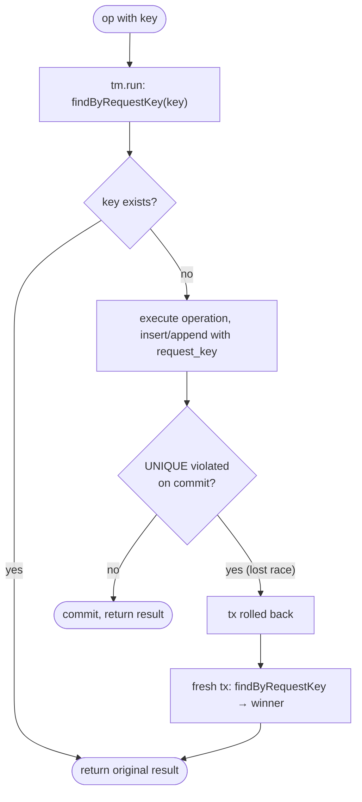

# Operation flows

Step-by-step flows for each `BankingService` operation, plus the two cross-cutting concerns —
concurrency (transactions + row locks) and idempotency. Every mutating operation is **atomic**:
all balance changes and the ledger posting commit together in one database transaction, or — on
any failure — the whole transaction rolls back, leaving nothing behind.

## Deposit

## Withdrawal

Same shape as deposit, but the sufficiency check runs **with the row locked** so a concurrent
withdrawal cannot overdraw:

## Transfer — same currency

## Transfer — cross currency (FX)

When source and destination currencies differ, the amount is converted at the spot rate and the
FX contra absorbs the position (and any rounding residue) so each currency leg balances
independently:

## Account creation & balance

A zero opening deposit creates the account but posts no ledger transaction.

## Concurrency: ordered row locking

Accounts are always locked (`SELECT … FOR UPDATE`) in `AccountId.compareTo` order. Two transfers
running in opposite directions between the same accounts therefore request the **same** lock
sequence — there is no cyclic wait, so the system cannot deadlock. Locks are held until the
transaction commits or rolls back.

Self-transfers are de-duplicated before locking (the id set has one element), so a single row is
locked. H2's MVCC (on by default in 2.x) provides row-level locking for `FOR UPDATE`; a generous
`LOCK_TIMEOUT` ensures a contended lock waits rather than failing fast — canonical ordering means
the wait always resolves.

## Idempotency: at-most-once execution

Mutating operations accept an optional `IdempotencyKey`. The key is stored as a `UNIQUE` column on
the entity the operation produced (`accounts.request_key` for createAccount, `transactions.request_key`
otherwise). The service checks by key first and **returns the original result** on a hit (a retry
never re-executes); on a concurrent same-key race the loser's whole transaction rolls back and it
re-reads the winner. Conflict detection for a key reused with **different** parameters is not
provided — a duplicate simply returns the original.

Because the losing transaction is rolled back before the re-read, a balance is never applied twice.
Operations called without a key insert `NULL` (NULLs are distinct in UNIQUE, so they never collide)
and always execute.
