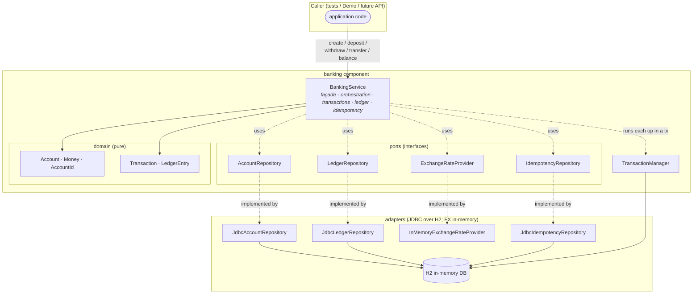
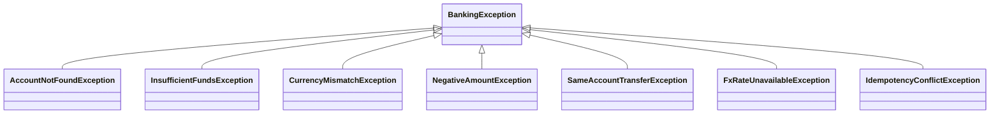

# System overview

A **software component** (not a deployable service — there is no HTTP layer) that simulates
basic banking: account creation, deposit, withdrawal, transfer, and balance enquiry. It is
multi-currency, thread-safe, keeps a balanced double-entry ledger, persists to an in-memory
relational database (H2), and supports idempotent operations.

## Goals & non-goals

- **Goals:** exact money handling; atomic, deadlock-free operations under concurrency; a fully
  auditable, SQL-queryable ledger; a design that swaps to a server-side database (Postgres/MySQL)
  with new adapters only.
- **Non-goals (this iteration):** HTTP/REST API, authentication, interest/fees, a *durable* /
  server-side persistence backend (H2 runs in-process), multi-instance clustering. See the README
  "Out of scope" section.

## Layered architecture

The component follows a ports-and-adapters (hexagonal) shape. The **domain** is pure and knows
nothing about storage or FX feeds. **Ports** are interfaces; **adapters** are the JDBC (and FX)
implementations. `BankingService` is the only orchestration point and the only place that opens
transactions and takes row locks.

## Component responsibilities

| Component | Package | Responsibility |
|---|---|---|
| `BankingService` | `banking` | Public façade. Validates input, opens a transaction, locks rows, mutates accounts, posts ledger transactions, applies FX, and guards idempotency. The **only** transaction/lock owner. |
| `TransactionManager` | `banking.db` | Runs a unit of work in one DB transaction: `autoCommit=false`, commit on success, rollback on any failure. |
| `Money`, `Account`, `Transaction`, `LedgerEntry`, ids | `banking.domain` | Immutable value objects and the double-entry ledger records. `Transaction.create` enforces the per-currency balance invariant. |
| `AccountRepository` / `LedgerRepository` | `banking.repo` | Storage ports + JDBC adapters. Methods take the caller's `Connection`; `findForUpdate` issues `SELECT … FOR UPDATE`. **No** multi-key atomicity of their own (that is the transaction's job). |
| `IdempotencyRepository` | `banking.idempotency` | At-most-once port + JDBC adapter: claim a `UNIQUE` request key inside the transaction, load on replay. |
| `ExchangeRateProvider` | `banking.fx` | FX rate port + in-memory adapter. Throws if a rate is missing. |
| `DatabaseInitializer` / `H2DataSources` | `banking.db` | Builds the H2 in-memory `DataSource` and applies `schema.sql`. |
| `ContraAccountIds` | `banking.ledger` | Well-known system contra accounts (`CASH_CONTRA`, `FX_CONTRA`) used to balance postings. |

## Key design rules

1. **Transactions and row locking live in the service, never in repositories.** The unit of
   atomicity (which accounts must change together) is a service concern; a repository is a dumb,
   swap-able mapper that runs against the connection it is handed.
2. **Money is never a `double`.** Balances and amounts are `long` minor units; `BigDecimal` appears
   only at the FX boundary with explicit `HALF_UP` rounding.
3. **Accounts are immutable.** `credit`/`debit` return new `Account` instances; the row lock
   (`SELECT … FOR UPDATE`) serialises the read → compute → write cycle, keyed by the stable
   `AccountId`.
4. **Every mutation posts a balanced transaction.** Nothing changes a balance without a matching,
   per-currency-zero-sum ledger entry set, committed in the same transaction.

## Exception model

All failures are unchecked subclasses of `BankingException`, so the façade stays clean while
callers can catch specific conditions.

