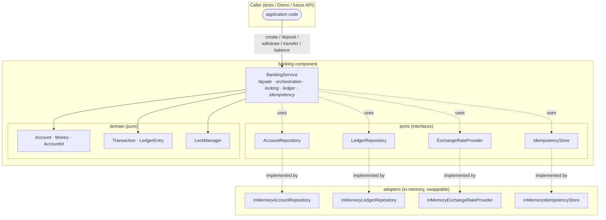

# System overview

A **software component** (not a deployable service — there is no HTTP layer) that simulates
basic banking: account creation, deposit, withdrawal, transfer, and balance enquiry. It is
multi-currency, thread-safe, keeps a balanced double-entry ledger, and supports idempotent
operations.

## Goals & non-goals

- **Goals:** exact money handling; atomic, deadlock-free operations under concurrency; a fully
  auditable ledger; a design that swaps to a real database with new adapters only.
- **Non-goals (this iteration):** HTTP/REST API, authentication, interest/fees, a real
  persistence backend, a durable/shared idempotency store. See the README "Out of scope" section.

## Layered architecture

The component follows a ports-and-adapters (hexagonal) shape. The **domain** is pure and knows
nothing about storage or FX feeds. **Ports** are interfaces; **adapters** are the in-memory
implementations. `BankingService` is the only orchestration point and the only place that takes
locks.

## Component responsibilities

| Component | Package | Responsibility |
|---|---|---|
| `BankingService` | `banking` | Public façade. Validates input, acquires locks, mutates accounts, posts ledger transactions, applies FX, and guards idempotency. The **only** lock holder. |
| `LockManager` | `banking.concurrency` | Owns one `ReentrantLock` per `AccountId`; acquires multiple locks in a single, deadlock-free global order. |
| `Money`, `Account`, `Transaction`, `LedgerEntry`, ids | `banking.domain` | Immutable value objects and the double-entry ledger records. `Transaction.create` enforces the per-currency balance invariant. |
| `AccountRepository` / `LedgerRepository` | `banking.repo` | Storage ports + in-memory adapters. Thread-safe individually; **no** multi-key atomicity (that is the service's job). |
| `ExchangeRateProvider` | `banking.fx` | FX rate port + in-memory adapter. Throws if a rate is missing. |
| `IdempotencyStore` | `banking.idempotency` | At-most-once execution port + in-memory adapter (key claim + replay). |
| `ContraAccountIds` | `banking.ledger` | Well-known system contra accounts (`CASH_CONTRA`, `FX_CONTRA`) used to balance postings. |

## Key design rules

1. **Locking lives in the service, never in repositories.** The unit of atomicity (which accounts
   must change together) is a service concern; a repository is a dumb, swap-able store.
2. **Money is never a `double`.** Balances and amounts are `long` minor units; `BigDecimal` appears
   only at the FX boundary with explicit `HALF_UP` rounding.
3. **Accounts are immutable.** `credit`/`debit` return new `Account` instances; the per-account
   lock serialises the load → compute → store cycle, keyed by the stable `AccountId`.
4. **Every mutation posts a balanced transaction.** Nothing changes a balance without a matching,
   per-currency-zero-sum ledger entry set.

## Exception model

All failures are unchecked subclasses of `BankingException`, so the façade stays clean while
callers can catch specific conditions.

